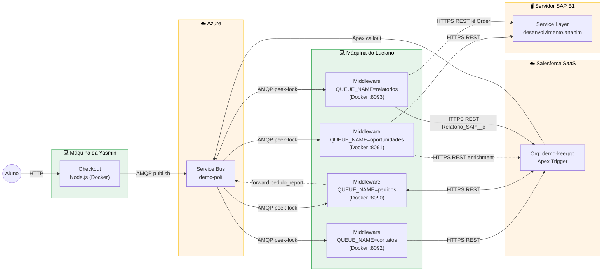

# Demo Keeggo — Visão geral

Demo end-to-end de integração entre site de checkout, Salesforce (CRM) e SAP
B1 (ERP), usando Azure Service Bus como barramento assíncrono. Cada sistema
roda num ambiente diferente e desacoplado — ninguém fala direto com ninguém.

## O que a demo prova

Um aluno fecha um pedido no site → o pedido vira uma Opportunity no Salesforce
→ quando a Opp é marcada como ganha, uma Order é criada no SAP. Tudo
automaticamente, em segundos, via mensageria.

Objetivos demonstrados:
- **Desacoplamento**: se Salesforce ou SAP ficarem fora do ar, as mensagens
  ficam na fila e são processadas quando o serviço voltar (at-least-once).
- **Idempotência**: mensagens podem ser reprocessadas sem criar duplicatas —
  SF usa External ID `Correlation_Id__c`, SAP usa `NumAtCard`.
- **Rastreabilidade**: uma jornada inteira é seguida por um único
  `correlation_id`, registrado nos 3 sistemas.
- **Recuperabilidade**: mensagens que falham vão para a DLQ e podem ser
  reinjetadas depois que o problema for corrigido.

## Atores e responsabilidades

| Ator | Onde roda | Responsabilidade |
|---|---|---|
| **Checkout** | Docker na máquina da Yasmin | Frontend + API Node.js. Publica `aluno_cadastrado` em `contatos` ao fim do cadastro do aluno; `pedido_criado`/`pagamento_aprovado` em `pedidos` durante a compra. |
| **Service Bus** | Azure cloud (`demo-poli.servicebus.windows.net`) | Transporte. 3 filas (`contatos`, `pedidos`, `oportunidades`), cada uma com sua DLQ. |
| **Middleware (`contatos`)** | Docker na máquina do Luciano | Consome `contatos`, upsert Contact no Salesforce (por `Aluno_Id__c`). |
| **Middleware (`pedidos`)** | Docker na máquina do Luciano | Consome `pedidos`, cria/atualiza Opportunity + liga ao Contact via `OpportunityContactRole`. Também reenvia `pedido_report`/`relatorio_sap_request` pra fila `relatorios` (Forwarder). |
| **Middleware (`relatorios`)** | Docker na máquina do Luciano | Consome `relatorios`, lê Order no SAP pelo `NumAtCard` e popula `Relatorio_SAP__c` + `Relatorio_SAP_Linha__c` no SF. |
| **Salesforce** | SaaS (`demo-keeggo-dev-ed.develop.my.salesforce.com`) | CRM. Armazena Opp com 17 campos custom. Trigger Apex publica `oportunidade_ganha` quando a Opp vira Closed Won. |
| **Middleware (`oportunidades`)** | Docker na máquina do Luciano | Consome `oportunidades`, busca dados ricos da Opp via REST, cria Sales Order no SAP com 8 UDFs populados e Comments resumido. |
| **SAP B1** | Service Layer em servidor Keeggo (`desenvolvimento.ananim.com.br:50000`) | ERP. Recebe o pedido como Sales Order. |

## Topologia dos ambientes

Cada caixa externa representa um **ambiente físico/lógico separado**. As setas
representam **tráfego de rede real** entre ambientes — nenhum sistema tem
dependência de processo local com outro.

## Fluxo resumido (1 jornada)

1. Aluno se cadastra no site → Checkout publica `aluno_cadastrado` em `contatos`.
2. Middleware-contatos consome → upsert Contact no SF (por `Aluno_Id__c`).
3. Aluno finaliza pedido → Checkout publica `pedido_criado` em `pedidos`.
4. Middleware-pedidos consome → cria Opportunity (stage *Prospecting*) + `OpportunityContactRole` ligando ao Contact.
5. Aluno paga → Checkout publica `pagamento_aprovado` em `pedidos`.
6. Middleware-pedidos consome → marca a Opp como *Closed Won*.
7. Trigger Apex detecta o stage novo → publica `oportunidade_ganha` em `oportunidades`.
8. Middleware-oportunidades consome → puxa dados extras da Opp via REST → cria Sales Order no SAP.

Tempo total típico: 5-10 segundos do clique no "pagar" até a Order aparecer
no SAP.

## Tecnologias

| Camada | Tecnologia |
|---|---|
| Transporte | Azure Service Bus (AMQP 1.0) |
| Middleware | Python 3.12, `azure-servicebus`, `requests` |
| Containerização | Docker (multi-stage build), imagem ~130 MB |
| Checkout | Node.js, producer.js usando `@azure/service-bus` |
| SF | REST API v66.0 + Apex Trigger + 17 Custom Fields |
| SAP | B1 Service Layer v2 + 8 UDFs na tabela ORDR |

## Operação diária

- **Iniciar o middleware**: dois contêineres (um por fila) são subidos com
  `docker run`. Ver `deploy/README.md` para os comandos.
- **Monitorar filas**: `python scripts/list_queues.py` (contagem active/DLQ).
- **Ver mensagens sem consumir**: `python scripts/receive.py` (todas as
  filas) ou `python scripts/receive.py dlq` (DLQs).
- **Reprocessar mensagens em erro**: `python scripts/redrive_dlq.py`.
- **Ver Orders criadas no SAP**: `python scripts/sap_get_order.py --recent 10`.

Detalhes operacionais em `docs/runbook.md`.

## Documentação relacionada

- `docs/message-flow.md` — fluxo detalhado de mensagens com sequence diagram
- `docs/architecture.md` — decisões de design, componentes internos, observabilidade
- `docs/message-contract.md` — schemas canônicos de cada tipo de mensagem
- `docs/runbook.md` — operação de filas e troubleshooting
- `deploy/README.md` — build e run dos contêineres
