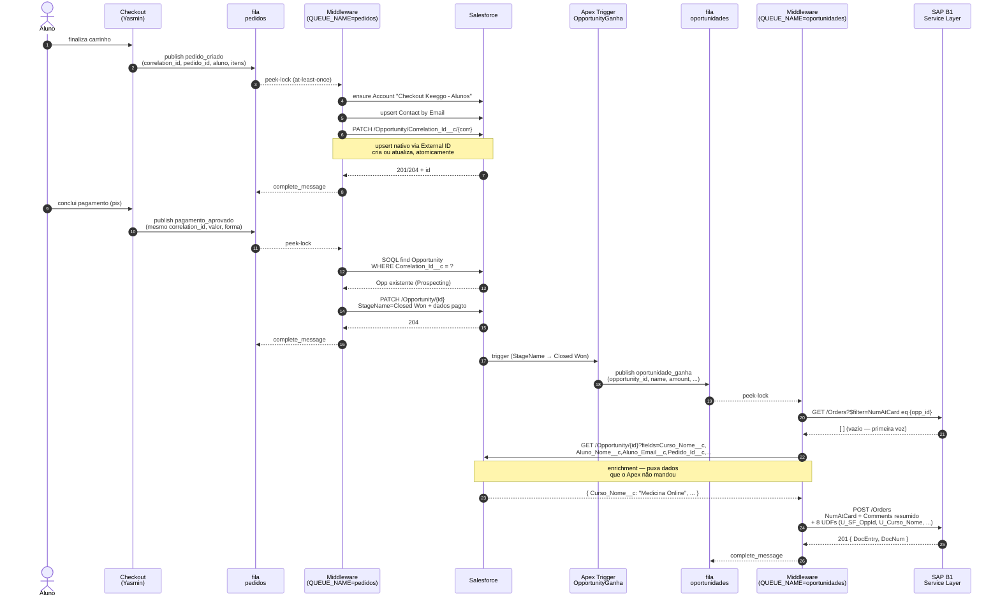
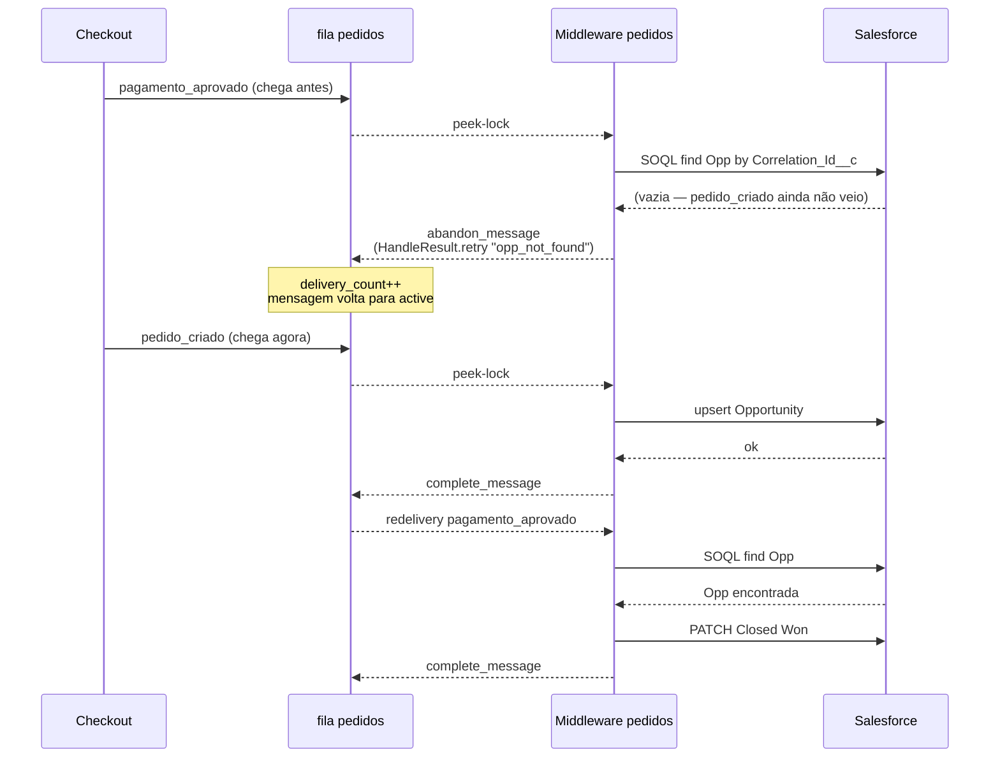
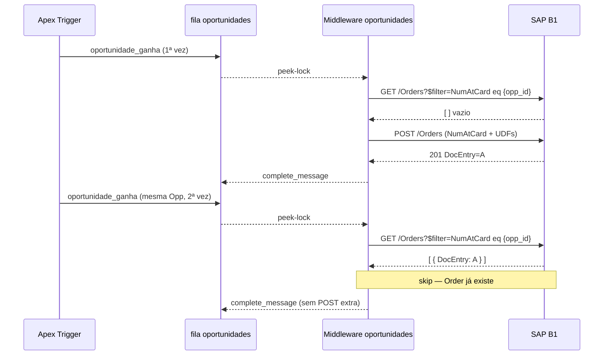
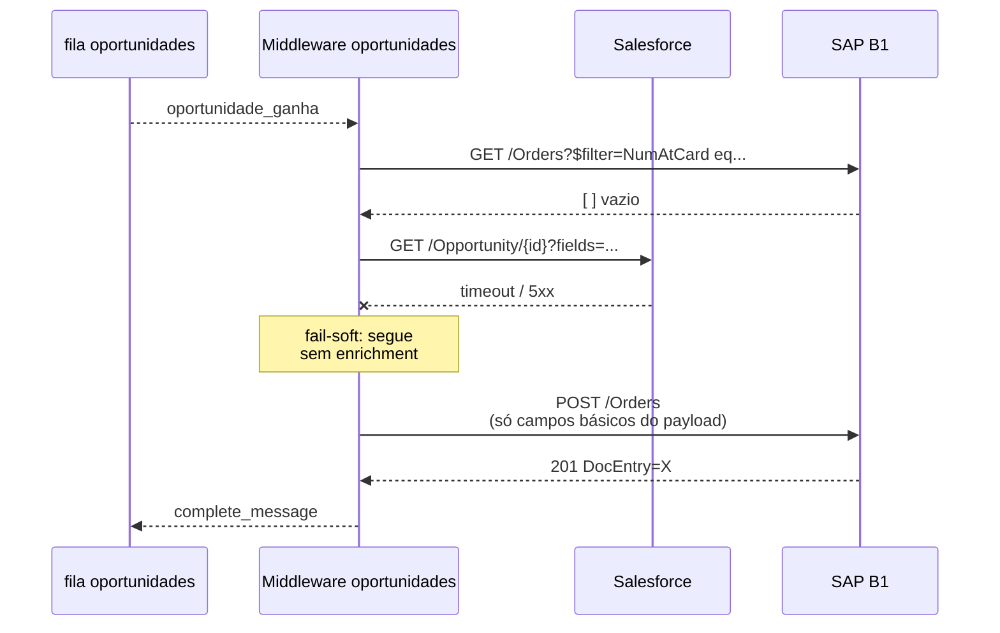
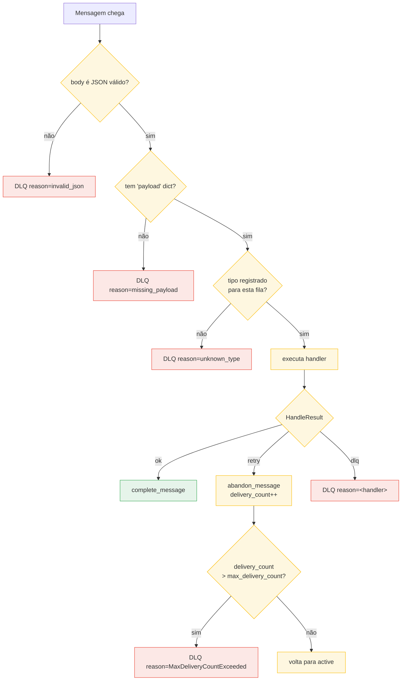

# Fluxo de mensagens — detalhado

Como as 3 mensagens (`pedido_criado`, `pagamento_aprovado`,
`oportunidade_ganha`) fluem pelas 2 filas (`pedidos`, `oportunidades`) e
quais interações cada consumer executa. Complementa `docs/demo-overview.md`
(topologia) com o "quem fala com quem" passo-a-passo.

Para referência dos schemas de cada mensagem, ver
`docs/message-contract.md`.

---

## 1. Jornada completa (happy path)



**Observações sobre a numeração:**
- Passos 1-9: leg de `pedido_criado` (cria Opp em Prospecting).
- Passos 10-16: leg de `pagamento_aprovado` (fecha a mesma Opp).
- Passos 17-24: leg de `oportunidade_ganha` (cria Order no SAP).

Total: entre 15 e 20 chamadas HTTP entre sistemas, todas com retry e
idempotência nativas.

---

## 2. O que acontece em cada fila

### Fila `pedidos`
- **Producer**: Checkout (Node).
- **Consumer**: Middleware rodando com `QUEUE_NAME=pedidos` (pod #1).
- **Tipos aceitos**: `pedido_criado`, `pagamento_aprovado`.
- **Destino de sucesso**: Salesforce (Account/Contact/Opportunity).
- **Chave idempotente**: `payload.correlation_id` → `Opportunity.Correlation_Id__c`.

### Fila `oportunidades`
- **Producer**: Apex Trigger `OpportunityGanhaTrigger` no Salesforce.
- **Consumer**: Middleware rodando com `QUEUE_NAME=oportunidades` (pod #2).
- **Tipo aceito**: `oportunidade_ganha`.
- **Destino de sucesso**: SAP B1 Service Layer (Sales Order).
- **Chave idempotente**: `payload.opportunity_id` → `Order.NumAtCard`.

---

## 3. Caminhos alternativos

### 3.1 Ordem invertida — `pagamento_aprovado` chega antes de `pedido_criado`



Depois de `max_delivery_count=5` sem sucesso, a mensagem vai automaticamente
para a DLQ com `reason=MaxDeliveryCountExceeded`.

### 3.2 Idempotência SAP — `oportunidade_ganha` duplicada



### 3.3 Enrichment com fallback — Salesforce fora do ar



A Order é criada com os campos mínimos (vindos do payload) e `Comments`
básico. Sem `Curso_Nome__c`, `Aluno_Email__c`, etc. — mas a demo continua
fluindo.

---

## 4. Caminhos de erro (DLQ)



**Tipos de falha por handler (pra contexto):**

| Handler | Condição | Ação |
|---|---|---|
| `pedido_criado` | payload sem `numero_pedido`/`pedido_id`/`aluno_nome`/... | DLQ `missing_required` |
| `pedido_criado` | `total` não-parseável | DLQ `invalid_total` |
| `pagamento_aprovado` | Opp não encontrada | RETRY `opp_not_found` (ordem invertida) |
| `oportunidade_ganha` | `sessionId` SAP vazio | RETRY `sap_session_unavailable` |
| `oportunidade_ganha` | SAP retorna 4xx (≠401/408/429) | DLQ `sap_http_4xx` |
| `oportunidade_ganha` | SAP retorna -2014 (schema stale) | RETRY `sap_schema_stale` |
| `oportunidade_ganha` | SAP 5xx / network | RETRY `sap_http_5xx` / `sap_network` |

Ver `docs/runbook.md` seção 5 e 10 para procedimentos de DLQ e
troubleshooting.

---

## 5. Rastreabilidade de ponta a ponta

Três identificadores são propagados pela jornada inteira:

| ID | Nascimento | Onde vai parar |
|---|---|---|
| `correlation_id` | Checkout (`jornada-<aluno_id>-<uuid>`) | `Opportunity.Correlation_Id__c` (SF) + `NumAtCard` (SAP via Apex) + todo log JSON |
| `pedido_id` | Checkout (numérico) | `Opportunity.Pedido_Id__c` (SF) + `U_Pedido_Id` (SAP UDF) |
| `opportunity_id` | Salesforce (autogerado) | `payload.opportunity_id` (msg Apex) + `Order.NumAtCard` (SAP) + `U_SF_OppId` (SAP UDF) |

Para debugar uma jornada específica, use `correlation_id`:

```bash
wsl.exe docker logs sb-consumer-pedidos 2>&1 | grep 'correlation_id":"jornada-1-831294cb'
wsl.exe docker logs sb-consumer-oportunidades 2>&1 | grep 'correlation_id":"sf-006g5000003'
```

Ou busque no SAP por `NumAtCard` (= opportunity_id SF) ou no SF por
`Correlation_Id__c`.
